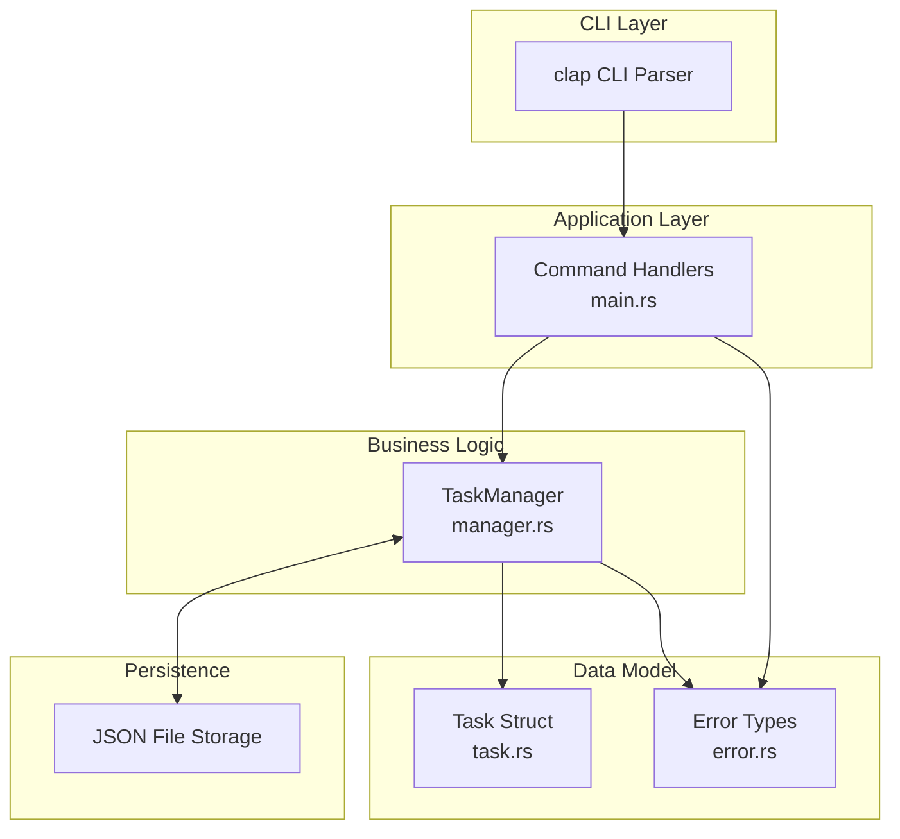
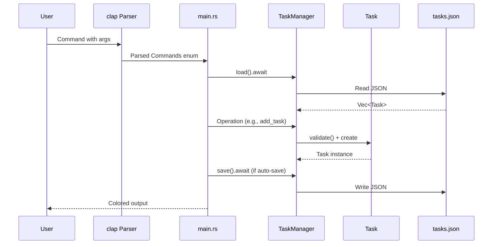

# Codebase Map

> Auto-generated by Cartographer. Last mapped: 2025-01-21

## System Overview

This is an **enterprise-grade Rust CLI task manager** featuring task CRUD operations, filtering, sorting, search, statistics, and interactive selection. The application uses a layered architecture with clean separation of concerns.



## Directory Structure

```
vector-based-task-manager/
├── src/
│   ├── main.rs       # Entry point, command handlers (4,058 tokens)
│   ├── cli.rs        # CLI structure with clap (1,485 tokens)
│   ├── manager.rs    # Task management logic (3,415 tokens)
│   ├── task.rs       # Task data structures (2,054 tokens)
│   └── error.rs      # Error type definitions (307 tokens)
├── Cargo.toml        # Dependencies and project config (338 tokens)
├── README.md         # Documentation (3,289 tokens)
├── install.sh        # Installation script (531 tokens)
└── tasks.json        # Default task storage (133 tokens)
```

## Module Guide

### src/main.rs

**Purpose:** Application entry point and command dispatch
**Entry point:** `main()` function (async via tokio)
**Key files:** 4,058 tokens

**Exports:** None (binary crate)

**Key Functions:**
| Function | Purpose |
|----------|---------|
| `main()` | Parse CLI, init logging, load tasks, dispatch command |
| `handle_add()` | Create new task with datetime parsing |
| `handle_list()` | Filter, sort, display tasks |
| `handle_show()` | Display task details |
| `handle_update()` | Selective field updates |
| `handle_complete()` | Mark as done (with optional ID → interactive) |
| `handle_start()` | Mark as in-progress |
| `handle_cancel()` | Mark as cancelled |
| `handle_delete()` | Delete with confirmation |
| `handle_delete_all()` | Bulk delete with double-confirmation |
| `handle_stats()` | Display statistics |
| `handle_clear()` | Remove completed/all tasks |
| `handle_import()` | Load from JSON with validation |
| `handle_export()` | Save to JSON |
| `select_task_interactive()` | Interactive task selection menu |
| `print_task_summary()` | Display single-line task summary |

**Dependencies:** cli, manager, task, error, clap, colored, tracing, tokio

**Constants:**
- `MAX_IMPORT_SIZE: 10MB` - Import size limit
- `MAX_INPUT_LENGTH: 1000` - User input validation
- `UUID_DISPLAY_LENGTH: 8` - Truncate UUIDs in display
- `TITLE_MAX_DISPLAY: 40` - Truncate long titles

**Gotchas:**
- Non-atomic auto-save could fail silently
- Load failure continues with empty list (data loss risk)
- No file locking (concurrent access could corrupt data)
- UUIDs truncated to 8 characters in display

---

### src/cli.rs

**Purpose:** CLI interface definition using `clap` derive API
**Entry point:** `Cli` struct (parsed by `Parser::parse()`)
**Key files:** 1,485 tokens

**Exports:**
- `pub struct Cli` - Root CLI structure
- `pub enum Commands` - All subcommands (13 variants)
- `pub enum PriorityArg` - CLI wrapper for Priority
- `pub enum StatusArg` - CLI wrapper for TaskStatus
- `pub enum SortArg` - CLI wrapper for TaskSort

**Commands (13 total):**
| Command | Description | Interactive |
|---------|-------------|-------------|
| `Add` | Create new task | No |
| `List` | Filter/sort tasks | No |
| `Show` | Display task details | No |
| `Update` | Modify task fields | No |
| `Complete` | Mark as done | Yes (ID optional) |
| `Start` | Mark as in-progress | Yes (ID optional) |
| `Cancel` | Mark as cancelled | Yes (ID optional) |
| `Delete` | Remove task | Yes (ID optional) |
| `DeleteAll` | Remove ALL tasks | No |
| `Stats` | Display statistics | No |
| `Clear` | Remove completed/all | No |
| `Import` | Load from JSON | No |
| `Export` | Save to JSON | No |

**Global Flags:**
- `-v, --verbose` - Enable debug logging
- `-f, --file <FILE>` - Override default storage path

**Dependencies:** clap (derive features)

**Gotchas:**
- Empty string `""` in Update clears optional fields
- Destructive operations require `--force` to skip confirmations
- Show/Update require full UUID (no partial matching)

---

### src/manager.rs

**Purpose:** Business logic layer for task management and persistence
**Entry point:** `TaskManager::new()` or `TaskManager::load().await`
**Key files:** 3,415 tokens

**Exports:**
- `pub struct TaskManager` - Main task management container
- `pub struct TaskManagerConfig` - Configuration for storage and auto-save
- `pub enum TaskSort` - Sorting criteria (8 variants)
- `pub struct TaskStats` - Aggregate statistics

**TaskManager Structure:**
```rust
pub struct TaskManager {
    pub tasks: HashMap<String, Task>,  // O(1) lookup by UUID
    pub config: TaskManagerConfig,
    pub dirty: AtomicBool,              // Track unsaved changes
}
```

**Core Operations:**
| Method | Purpose |
|--------|---------|
| `new()` / `with_config()` | Create manager |
| `load().await` / `save().await` | Persistence |
| `add_task()` / `add_task_detailed()` | Create task |
| `get_task()` / `get_task_mut()` | Retrieve by ID |
| `update_task()` | Selective field updates |
| `delete_task()` | Remove task |
| `complete_task()` / `start_task()` / `cancel_task()` | State changes |
| `get_all_tasks()` / `get_tasks_by_status()` / `get_tasks_by_priority()` | Queries |
| `get_overdue_tasks()` / `search_tasks()` / `get_sorted_tasks()` | Advanced queries |
| `clear_completed()` / `clear_all()` | Bulk operations |
| `import_tasks()` | Bulk import |
| `get_stats()` | Statistics |

**Sorting Options:**
- CreatedAsc/CreatedDesc (default)
- DueDateAsc/DueDateDesc
- PriorityAsc/PriorityDesc
- TitleAsc/TitleDesc

**Dependencies:** task, error, serde_json, tokio, uuid, validator

**Gotchas:**
- Non-atomic save (dirty check + save race condition)
- Uses `String` for HashMap keys instead of `Uuid` (inefficient)
- `get_sorted_tasks()` creates new Vec (expensive for large datasets)
- `load()` clears existing data (not additive)
- No bulk insert during import (one-by-one validation)

---

### src/task.rs

**Purpose:** Core data structures for tasks and business logic
**Entry point:** `Task::new(title)` or `Task::with_details(...)`
**Key files:** 2,054 tokens

**Exports:**
- `pub struct Task` - Main task data structure
- `pub enum Priority` - Low=1, Medium=2, High=3, Critical=4
- `pub enum TaskStatus` - Todo, InProgress, Done, Cancelled
- `pub enum UpdateValue<T>` - Keep, Clear, Set (three-state updates)
- `pub fn parse_datetime()` - ISO 8601 parser

**Task Structure:**
```rust
pub struct Task {
    pub id: Uuid,                      // Unique identifier
    pub title: String,                 // Required, 1-200 chars
    pub description: Option<String>,   // Optional, max 2000 chars
    pub priority: Priority,            // 1-4 ordinal
    pub status: TaskStatus,            // Lifecycle state
    pub category: Option<String>,      // Optional, max 50 chars
    pub due_date: Option<DateTime>,    // ISO 8601
    pub created_at: DateTime,          // Creation time
    pub updated_at: DateTime,          // Last modification
    pub completed_at: Option<DateTime> // Completion time
}
```

**Key Methods:**
| Method | Purpose |
|--------|---------|
| `new()` / `with_details()` | Create task |
| `complete()` / `start()` / `cancel()` | State transitions |
| `update()` | Selective field updates |
| `is_overdue()` | Check if past due (but not done) |
| `status_display()` / `priority_display()` | Formatted output with emojis |

**Dependencies:** serde, chrono, uuid, validator

**Gotchas:**
- `is_overdue()` returns false for completed tasks
- `Default` implementation creates empty title (may be invalid)
- `UpdateValue<T>` allows three-state operations (Keep/Clear/Set)

---

### src/error.rs

**Purpose:** Centralized error type definitions using `thiserror`
**Entry point:** `TaskError` enum
**Key files:** 307 tokens

**Exports:**
- `pub enum TaskError` - Comprehensive error variants
- `pub type Result<T>` - Alias for `std::result::Result<T, TaskError>`

**Error Variants:**
| Variant | Purpose |
|---------|---------|
| `TaskNotFound(String)` | Task doesn't exist |
| `ValidationError(String)` | Input validation failed |
| `IoError(std::io::Error)` | File I/O issues (auto-converted) |
| `JsonError(serde_json::Error)` | Serialization issues (auto-converted) |
| `DateParseError(String)` | Invalid datetime format |
| `FileOperationError(String)` | Custom file operation errors |
| `OperationNotAllowed(String)` | Business logic violations |

**Dependencies:** std, thiserror, validator

**Gotchas:**
- Validation errors aggregated into single string with field names
- All errors implement `Display` and `Debug` via `thiserror`

---

## Data Flow



### Command Flow Examples

**Add Task:**
```
user input → clap::Parser() → handle_add()
→ TaskManager::add_task() → Task::validate()
→ TaskManager::save().await → success message
```

**Interactive Complete:**
```
user input (no ID) → handle_complete()
→ select_task_interactive() → display menu
→ user selects index → TaskManager::complete_task()
→ Task::complete() → TaskManager::save().await → success message
```

## Conventions

**Naming:**
- Modules: `snake_case` (cli.rs, manager.rs)
- Structs: `PascalCase` (TaskManager, Task)
- Functions: `snake_case` (add_task, get_stats)
- Constants: `SCREAMING_SNAKE_CASE` (MAX_IMPORT_SIZE)

**Patterns:**
- **Error handling:** `Result<T>` type alias, `?` operator propagation
- **Validation:** Multi-layer (clap types → validator derive → business logic)
- **Builder pattern:** `Task::with_details()` for flexible construction
- **State machine:** TaskStatus transitions
- **Iterator-based queries:** Return `impl Iterator` for lazy evaluation
- **Colored output:** `colored` crate for visual hierarchy

**Style:**
- Rust 2021 edition
- 4-space indentation
- Comprehensive documentation comments
- Serde derives for all public structs

## Gotchas

### Critical Issues
1. **No file locking** - Multiple instances could corrupt data
2. **Load failure data loss** - Continues with empty list if load fails
3. **Non-atomic save** - Dirty check and save have race condition
4. **No undo** - Destructive operations are permanent

### Performance
5. **String keys instead of Uuid** - HashMap wastes memory
6. **Expensive sort** - `get_sorted_tasks()` collects all tasks
7. **Search allocation** - Creates new strings per comparison
8. **No pagination** - All tasks loaded into memory

### Usability
9. **Rigid datetime parsing** - Only accepts RFC3339/ISO 8601
10. **UUID truncation** - Displays only 8 characters
11. **Inconsistent validation** - Split between handlers and manager
12. **Hardcoded constants** - Display limits not configurable

## Navigation Guide

**To add a new CLI command:**
1. Add variant to `Commands` enum in `src/cli.rs`
2. Add handler function in `src/main.rs`
3. Call handler in `main()` match statement
4. Implement logic using `TaskManager` methods

**To add a new task field:**
1. Add field to `Task` struct in `src/task.rs`
2. Add validation attributes (if needed)
3. Update `UpdateValue` usage in `Task::update()`
4. Add to `Add` and `Update` commands in `src/cli.rs`
5. Update handlers in `src/main.rs`

**To modify storage format:**
1. Update `TaskManager::load()` in `src/manager.rs`
2. Update `TaskManager::save()` in `src/manager.rs`
3. Ensure serde derives are correct in `src/task.rs`

**To add new query method:**
1. Add method to `TaskManager` in `src/manager.rs`
2. Return `impl Iterator<Item = &Task>` for lazy evaluation
3. Use filter/adapt patterns from existing methods

**To change error handling:**
1. Add variant to `TaskError` enum in `src/error.rs`
2. Use `#[from]` for automatic conversions
3. Update handler error propagation in `src/main.rs`

## Dependencies

**Runtime dependencies:**
- `clap 4.4` - CLI parsing
- `serde 1.0` + `serde_json 1.0` - Serialization
- `chrono 0.4` - Date/time handling
- `tokio 1.0` - Async runtime
- `tracing 0.1` + `tracing-subscriber 0.3` - Logging
- `validator 0.20` - Input validation
- `thiserror 2.0` - Error derives
- `colored 2.0` - Terminal colors
- `uuid 1.0` - Unique identifiers

**Development dependencies:**
- `tempfile 3.8` - Temporary file testing
- `assert_cmd 2.0` - CLI testing
- `predicates 3.0` - Output assertions

## Testing Strategy

**Unit tests** (in each module):
- Task creation, completion, updates, overdue detection
- CRUD operations, search, statistics

**Integration tests** (via `assert_cmd`):
- CLI command behavior
- Output validation

**Test coverage areas:**
- Task state transitions
- Validation rules
- Persistence operations
- Query and filtering
- Error conditions
